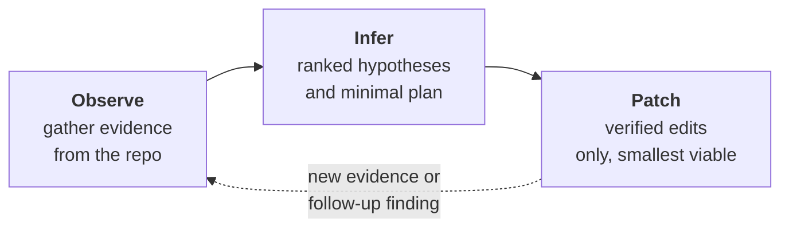
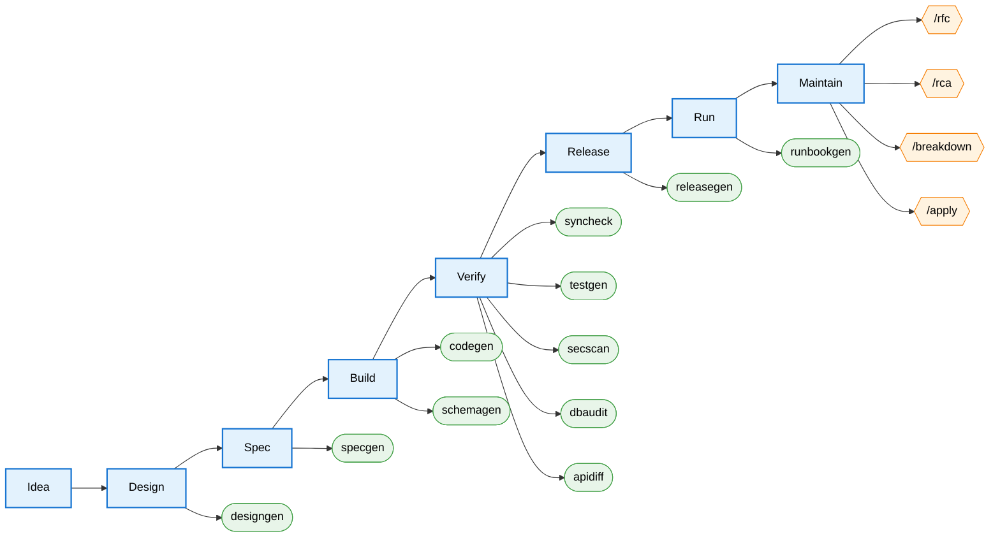
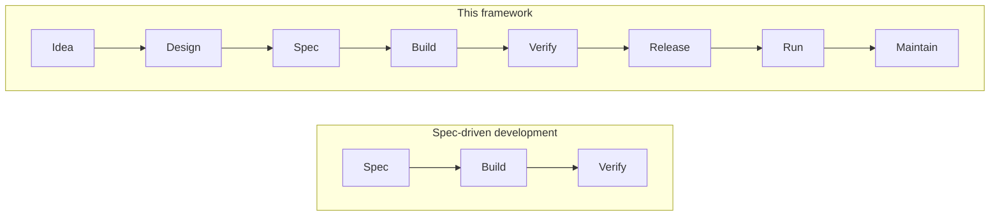

# Observe, Infer, Patch — an AI-assisted development framework

A configuration for AI coding assistants that applies a strict **Observe → Infer → Patch** discipline across the full software development lifecycle, with a human-in-the-loop gate at every irreversible step.

The discipline is deliberately narrow:

- separate evidence from reasoning,
- never fabricate identifiers, APIs, or schema objects,
- do not jump from symptoms to code changes,
- state uncertainty explicitly,
- edit only after the plan is grounded.

The lifecycle coverage is deliberately broad: the same discipline is applied from initial design through release, operation, and maintenance.

---

## The core loop



Every command and skill in this configuration implements one of these three modes — or composes them in sequence. The mode is not decorative; it changes what the assistant is allowed to do. Observation cannot edit files. Inference cannot propose patches. Patch mode cannot run until preconditions are verified.

---

## Why this exists

A common failure mode in LLM-assisted coding is:

1. seeing partial evidence,
2. inventing a plausible cause,
3. inventing a plausible function or API,
4. producing a confident but incorrect patch.

This configuration enforces a safer pattern:

- **Observe** — identify the most likely root cause using only what is shown in the repository.
- **Infer** — create a minimal remediation plan from evidence, with explicit assumptions.
- **Patch** — implement only the confirmed plan using verified identifiers.

Verification gates are not advisory. When `/codegen` finds a spec gap, it stops. When `/apply` finds a changed precondition, it stops. When `runbookgen` cannot verify an endpoint in source, the endpoint goes into a **Gaps** section — not the runbook body.

---

## Lifecycle coverage

The framework maps one skill or command to each stage of the lifecycle. All reading, analysis, and drafting runs automatically; every mutation (code edit, migration, tag, push) waits for the user.

Legend: **stages** are rectangles, **skills** (natural-language triggers) are rounded, **commands** (`/`-invoked) are hexagons.



| Stage | Tool | What it produces |
|---|---|---|
| Design | `designgen` | A design document from a problem statement, via interview. |
| Spec | `specgen` | Atomic, unambiguous technical specifications from the design. |
| Build | `codegen`, `schemagen` | Code and migrations for one component per invocation. |
| Verify | `syncheck`, `testgen`, `secscan`, `dbaudit`, `apidiff` | Drift, coverage, security, schema, and API-surface reports. |
| Release | `releasegen` | Changelog fragment, semver bump recommendation, release notes draft. |
| Run | `runbookgen` | Operational runbook drafted from the source code. |
| Maintain | `/rfc`, `/rca`, `/breakdown`, `/apply` | Change capture, diagnosis, phased planning, and one-phase-at-a-time implementation. |

The detailed user-facing guide lives in [`claude/.claude/README.md`](./claude/.claude/README.md).

---

## How this differs from spec-driven development

Spec-driven development (SDD) is a methodology for the **middle** of the lifecycle: specification drives code generation, and drift between spec and code is the primary concern.



This framework contains SDD as its middle third, then wraps it with:

- **Upstream of spec** — `designgen` captures intent from a problem statement before there is a spec.
- **Downstream of verify** — `releasegen`, `runbookgen`, and the `/rfc → /rca → /breakdown → /apply` maintenance loop cover release, operation, and change management.
- **Same discipline everywhere** — evidence before claims, gates before mutation, verified identifiers only. SDD's spec↔code drift check (`syncheck`) is one instance of a pattern applied at every stage.

It is not a replacement for SDD. It is SDD embedded in a full-lifecycle discipline.

---

## What this framework deliberately is not

- **Not autonomous.** Every mutation is proposed, not executed. Commits, tags, pushes, migrations against shared databases, PR creation — all explicit user actions.
- **Not a methodology for humans.** It configures an AI assistant. It does not dictate how a team writes tickets, runs standups, or organises repositories.
- **Not a product.** The assets under `claude/.claude/` are a configuration — plain Markdown rules, commands, and skills. Read any file; there is no hidden behaviour.
- **Not tied to a specific stack.** The stage coverage is generic. Individual skills cite Go, TypeScript, SQL, NATS, or Kubernetes as examples, but the discipline applies to any language or platform the AI assistant can read.

---

## How to use this repository

1. Copy the contents of `claude/.claude/` into `.claude/` at the root of your project.
2. Add the following to your `CLAUDE.md`:
   ```yaml
   ## Working modes

   @.claude/rules/working-modes.md
   ```
3. Read [`claude/.claude/README.md`](./claude/.claude/README.md) for the user-facing guide — which command or skill to invoke for each activity.
